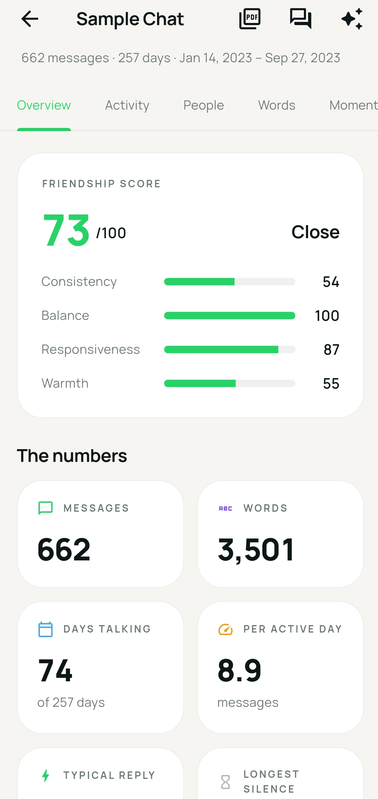
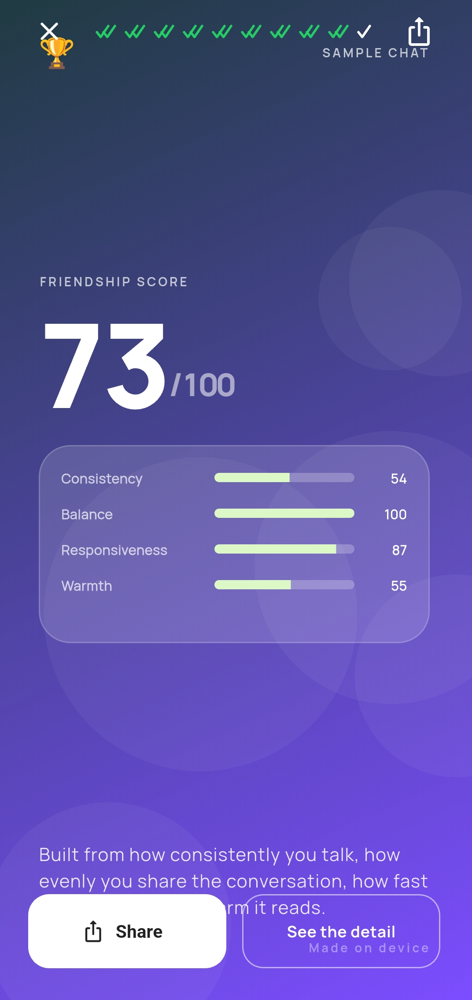
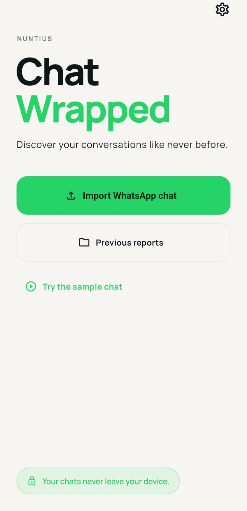

<div align="center">

# Nuntius

**Your WhatsApp chats, analysed — without them ever leaving your phone.**

[](https://flutter.dev)
[](https://dart.dev)
[]()
[]()
[](#license)

Import an exported chat. Get statistics, a Wrapped-style story, a readable
archive and a printable report — all computed locally, on your device.

</div>

---

## Screenshots


|                       Dashboard                       |                       Wrapped                       |                       Import                       |
| :----------------------------------------------------: | :--------------------------------------------------: | :-------------------------------------------------: |
|  |  |  |

---

## Why

Chat exports are one of the most personal files most people own — years of
conversation in a single text file. Every tool that offers to analyse one asks
you to upload it first.

Nuntius doesn't. Parsing, analysis, report generation and image export all run
in a local isolate on the device. There is no server, no account, no analytics
SDK and no crash reporter. The app makes exactly one network call in its default
configuration — a font fetch that carries no chat data — and [that can be
removed](#fonts) too.

---

## Features

- **Import anything WhatsApp gives you** — the `.zip` export or a loose `.txt`,
  from local storage, Google Drive, or any document provider. No size limit.
- **Dashboard** — overview and scores, activity over time, per-person
  breakdowns and awards, word and emoji analysis, milestones and badges, plus
  full-text search across every message.
- **Wrapped** — a swipeable story of the chat's highlights, with any card
  exportable as a 1080px image.
- **Messages** — the conversation read back, one month at a time, laid out like
  a chat.
- **PDF report** — cover, summary, participant table, vector charts, insights,
  timeline, and a method note explaining how every number was derived.
- **Handles real exports** — iOS and Android formats, day/month/year-first
  dates, 12- and 24-hour clocks, multi-line messages, localised media
  placeholders, system lines, and code-switched Roman-Urdu/Hindi text.

---

## Getting started

```bash
git clone https://github.com/yourhandle/nuntius.git
cd nuntius
flutter create --platforms=android,ios .   # generates native runner dirs
flutter pub get
flutter run
```

Requires **Flutter 3.22+** (the code uses records and pattern matching).

The `flutter create` step only writes native boilerplate — it won't touch
anything in `lib/`.

### Exporting a chat from WhatsApp

1. Open the chat
2. Tap the chat name → **Export chat**
3. Choose **Without media**
4. Save it anywhere

Hand Nuntius the `.zip` or the `.txt` — the zip is unpacked for you.

---

## How it works

```
lib/
├── core/
│   ├── constants/     analytics tuning, app metadata
│   ├── extensions/    date and duration helpers
│   ├── services/      import, archive, storage, image export
│   ├── theme/         colours, gradients, typography
│   ├── utils/         formatters, emoji, stopwords, text
│   └── widgets/       shared UI
├── features/
│   ├── analytics/     engine + 11 analyzers
│   ├── dashboard/     6 tabs
│   ├── developer/     about screen
│   ├── home/          landing
│   ├── import_chat/   picker, zip, preview, progress
│   ├── messages/      month-by-month reader
│   ├── onboarding/    splash + intro
│   ├── parser/        WhatsApp format patterns
│   ├── reports/       saved chats, PDF generation
│   ├── settings/      theme, animation, storage
│   └── wrapped/       story cards, share sheet
├── models/            plain data classes
├── providers/         Riverpod
├── repositories/      Hive + SharedPreferences
└── routes/            go_router
```

~12,500 lines across 73 files. Clean architecture, Riverpod for state,
go_router for navigation.

<details>
<summary><b>The import path</b></summary>

Parsing and analysis run in **one** isolate, and the result returns via
`Isolate.exit` — which hands over the memory rather than copying it. On a
250,000-message export that's the difference between a smooth progress bar and a
stalled one.

The file is streamed twice — once to detect date order, once to build messages —
and never held in memory as raw text. Hence **no file size limit**: peak memory
is set by the parsed message list, not by the file.

All analyzers are fed from a single loop through a shared `MessageContext` that
computes tokens, emoji and word counts once, lazily. Adding a statistic is one
class and one line, not another pass.

</details>

<details>
<summary><b>What gets stored</b></summary>

The full analytics are **not** serialised. Instead the export is copied into
app-private storage, a small JSON index entry goes into Hive, and reopening
re-parses and re-analyses in an isolate.

Tiny storage, no serialisation layer to drift from the models, and analyzer
improvements apply retroactively to every saved chat.

Stored files are addressed by **report id, resolved at read time** — never by an
absolute path saved earlier. On iOS the app container is addressed through a UUID
that changes on reinstall, so files survive while stored paths pointing at them
don't. Only the id is durable, so only the id is trusted.

</details>

<details>
<summary><b>Design decisions</b></summary>

**Manrope, not Poppins** — tall x-height and tabular figures keep big statistics
legible and stop numbers jittering as they count up.

**The double tick** — WhatsApp's delivery tick reused as a structural device:
the Wrapped progress indicator, the splash logo, the empty-state illustration.
Borrowed from the subject's own vernacular rather than invented.

**Scores are explainable** — balance is normalised Shannon entropy (so it
generalises to group chats), consistency is `sqrt(activeDays/totalDays)`,
responsiveness is `100/(1 + medianMinutes/20)`. The PDF states the formulas.

**Awards go on rates, not totals**, gated at ≥20 messages, so the person who
talks most doesn't sweep every category.

**Word clouds wrap, they don't spiral** — spiral packing is unreadable on a
phone. Fixed seed, so the same chat always yields the same layout.

**`AutoGrid`, not `GridView.count`** — a fixed `childAspectRatio` decides a
cell's height before its text is laid out, so any card whose copy wraps one line
further than expected overflows. `AutoGrid` measures rows intrinsically, making
overflow unrepresentable rather than merely unlikely.

**One animation setting for everything** — it drives `timeDilation`, the
framework-wide duration multiplier, so a single choice governs counters, charts,
the story *and* route transitions. "Off" sets `MediaQuery.disableAnimations`
instead, the same flag OS reduce-motion uses.

</details>

<details>
<summary><b>Supporting other platforms</b></summary>

The parser is the only WhatsApp-specific part. `ParsedChat` and `ChatMessage`
carry nothing platform-specific, and everything downstream reads those.
Telegram, Signal or Messenger support means writing one more parser that produces
a `ParsedChat`.

</details>

---

## Fonts

The PDF needs fonts bundled to render emoji and non-Latin scripts. A PDF carries
its own fonts; with none embedded, readers fall back to the "base 14" set, which
is Latin-1 only — and a missing glyph prints as *nothing*, not a substitute.

Drop these into `assets/fonts/`:

- `NotoSans-Regular.ttf`
- `NotoSans-Bold.ttf`
- `NotoEmoji-Regular.ttf` — the monochrome one, not Color Emoji

Without them the report degrades honestly rather than silently: emoji and
non-Latin text are stripped instead of printed as boxes, unrepresentable names
become "Participant 1", and the method note says so. Fonts are never downloaded.

The app's own typography uses `google_fonts`, which fetches Manrope on first
launch. To remove that call: bundle the Manrope TTFs, declare them under `fonts:`
in `pubspec.yaml`, and set `GoogleFonts.config.allowRuntimeFetching = false`.

---

## Privacy

No chat content is transmitted, ever. There is no HTTP client anywhere in the
parser, analytics, storage or reporting paths.

- imports parsed in a local isolate
- saved copies in app-private storage, deletable from Settings
- PDFs and images go through the OS share sheet, which you control
- the developer screen hands URLs to the OS browser; nothing is fetched in-app

The one exception is the `google_fonts` fetch above, which carries no chat data.

---

## Testing on iOS from Windows

Xcode only runs on macOS, but you can rent one by the minute.

**Build** — GitHub Actions on a `macos-14` runner: `flutter build ios --release --no-codesign`, then zip `Runner.app` into a `Payload/` folder to make an IPA,
and download the artifact. macOS runner minutes bill at **10×** on private repos.

**Install** — [Sideloadly](https://sideloadly.io) on Windows: plug the iPhone in
over USB, drop the IPA in, sign in with a free Apple ID. Free signing allows 3
apps at a time, each expiring after 7 days.

You get a release build to tap through — no hot reload, no breakpoints, no device
logs. For real debugging, rent a cloud Mac and use the Simulator, though it won't
honestly reproduce file-picker or share-sheet behaviour.

---

## Accessibility

- system text scale honoured, clamped 0.85×–1.6× so big-number layouts survive
- reduce-motion respected automatically, with a manual override in Settings
- colour is never the only signal — charts and colour-coded rows carry labels
- tooltips on every icon-only button

---

## Roadmap

- [ ]  Telegram and Signal parsers
- [ ]  Group-chat-specific statistics
- [ ]  Widget test coverage
- [ ]  Bundled Manrope to remove the last network call

---

## Contributing

Issues and pull requests welcome. If you're reporting a parsing bug, the most
useful thing you can include is a **small anonymised excerpt** showing the line
format that failed — a few lines with names and content replaced is plenty.
Please don't attach a real export.

```bash
flutter analyze
flutter test
```

---

## Known rough edges

- `fl_chart` and `pdf` both move their APIs between minor versions; if the build
  fails, `dashboard/charts.dart` and `reports/pdf_report_service.dart` are the
  first places to look
- the PDF renders emoji only when the optional fonts are bundled
- tests cover the parser and analytics engine; UI coverage is thin

---

## License

Not yet chosen. Without a licence file, default copyright applies and others have
no right to reuse this code — pick one before publishing if that isn't what you
want. [MIT](https://choosealicense.com/licenses/mit/) for permissive reuse,
[GPL-3.0](https://choosealicense.com/licenses/gpl-3.0/) to keep derivatives open.

---

<div align="center">

Built with Flutter. Nothing leaves your device.

</div>
